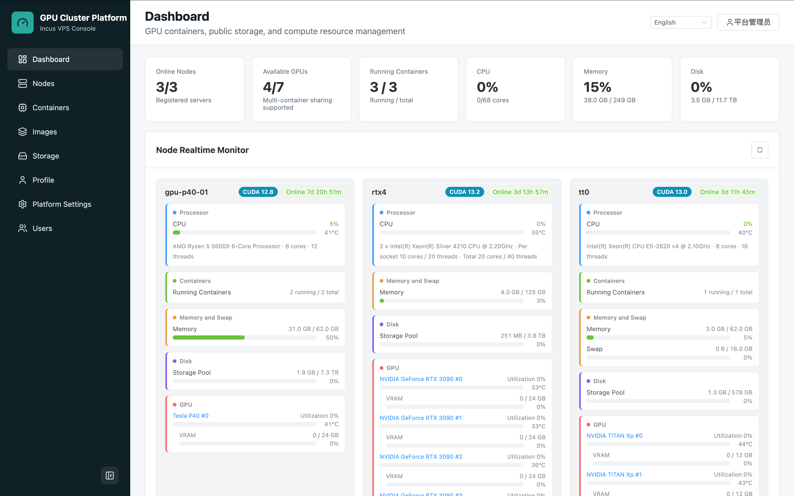

<h1 align="center">Server VPS</h1>

<p align="center">
  <a href="LICENSE"></a>
  <a href="README.md"></a>
</p>

A GPU container management platform for small research groups. server-vps uses one management node and multiple GPU/storage nodes to centralize Incus containers, GPU allocation, user quotas, port access, data directories, and node agent releases in a web console.

The default deployment only runs the platform services and uses local account login. External OIDC/CAS SSO, Casdoor pending-user import, and platform self-registration are optional features.

<p align="center">
  
</p>

## Project Scope

server-vps is designed for:

- Small research groups, labs, and course environments that share a limited number of GPU servers.
- Users who should create and manage Linux containers from a web UI instead of logging into the host directly.
- Administrators who need to manage user quotas, node permissions, container ports, shared datasets, model caches, and node agent versions.
- Sites that already have external identity, monitoring, and TLS systems and want this project to focus on GPU container resource management.

It is not a full Kubernetes replacement, and it does not bundle an identity provider, monitoring stack, or public-cloud billing system.

## Features

- Dashboard: online nodes, GPUs, running containers, CPU, memory, disk usage, and node monitoring.
- Node management: single-node join tokens, node types, scheduling policies, resource limits, port policies, Wake-on-LAN, sync addresses, SSH public keys, node shell, shutdown, reboot, and wake actions.
- Agent releases: build `cluster-node-agent` / `cluster-agent-updater` artifacts from the web console, configure stable/canary auto-updates, and trigger node upgrades.
- Container management: create Incus containers with selected images, nodes, CPU/memory/GPU resources, SSH users, and port mappings; start, stop, restart, shell into, resize, publish images from, and sync data for containers.
- Port access: the platform allocates public ports on the management node, and `port-router` forwards them to Incus proxy ports on compute nodes.
- Storage center: personal files, shared datasets, model resources, upload/download/preview, Hugging Face / ModelScope resource requests, ZFS user datasets, and workspace volumes.
- Users and authentication: local accounts by default; optional external OIDC/CAS SSO; user groups, quotas, node permissions, and pending SSO users managed by administrators.
- Platform self-registration: optional and disabled by default; production deployments should usually require administrator approval before enabling new users.

## Architecture Boundary

The management node runs these services with Docker Compose:

- `nginx`: the single Web/API entry point.
- `frontend`: Vue 3 + Vite + Element Plus admin console.
- `backend`: FastAPI API, scheduling, resource ledger, and agent communication.
- `postgres`: platform database.
- `port-router`: listens on public container ports on the management node and forwards traffic to compute nodes.

GPU/storage nodes run directly on the host:

- Incus.
- NVIDIA Driver and `nvidia-smi`, for GPU nodes only.
- `cluster-node-agent`.
- Optional `cluster-agent-updater`.

The current Compose stack does not include:

- Casdoor, Keycloak, or other identity providers. They can be connected as external OIDC/CAS providers.
- Prometheus/Grafana. Node exporters can be scraped by an external monitoring system.
- TLS termination. For production, place an external reverse proxy or load balancer in front of the platform.

## Quick Start

```bash
cp deploy/.env.example deploy/.env
```

At minimum, change:

```text
POSTGRES_PASSWORD
ADMIN_INITIAL_PASSWORD
PORT_ROUTER_TOKEN
```

By default, the platform only shows local account login. SSO and registration policies can be enabled later in "Platform Settings" after an administrator logs in.

Start the stack:

```bash
./scripts/docker-build-run.sh
```

Or run Docker Compose manually:

```bash
docker compose -f deploy/docker-compose.yml up -d --build
```

Open:

```text
http://<management-node-ip>:<HTTP_PORT>/
```

Initial administrator:

```text
Username: admin
Password: ADMIN_INITIAL_PASSWORD from deploy/.env
```

Health check:

```bash
curl http://127.0.0.1:${HTTP_PORT:-80}/api/health
docker compose -f deploy/docker-compose.yml ps
```

## Key Configuration

| Variable | Description |
| --- | --- |
| `HTTP_PORT` | Web/API entry port on the management node |
| `POSTGRES_PASSWORD` | PostgreSQL password; must be changed for production |
| `ADMIN_INITIAL_PASSWORD` | Initial administrator password; must be changed for production |
| `PORT_RANGE_START` / `PORT_RANGE_END` | Public port pool on the management node for user container services |
| `NODE_PORT_RANGE_START` / `NODE_PORT_RANGE_END` | Internal Incus proxy port pool on compute nodes |
| `PORT_ROUTER_TOKEN` | Token used by `port-router` to read the internal route table; must be changed for production |
| `SYNC_SSH_IDENTITY_FILE` | Private key path for cross-node data sync |
| `AGENT_SOURCE_HOST_PATH` | Host source path used by the backend when building agent binaries with Docker |

See [docs/deployment.md](docs/deployment.md) for full deployment notes and [deploy/.env.example](deploy/.env.example) for the environment template.

## External SSO

server-vps does not embed or reverse-proxy Casdoor. The platform uses local accounts by default. If you need centralized authentication, log in as an administrator and enable an external OIDC/CAS provider in "Platform Settings".

When using a standalone Casdoor deployment, treat it as an external OIDC provider. Casdoor SMTP, verification codes, database migrations, and password migration scripts should be maintained in the Casdoor project. See [docs/authentication.md](docs/authentication.md).

## Node Onboarding

1. Log in as an administrator and open "Node Management".
2. Generate a single-node join token.
3. Install Incus, the NVIDIA driver, and `cluster-node-agent` on the new node.
4. Start the agent with the generated `/etc/cluster-node-agent.env` and systemd service. Example systemd files are also available under `deploy/systemd/` and should be adjusted for your site.
5. After the node comes online, create a test container from the platform.

See [docs/node-onboarding.md](docs/node-onboarding.md) for the full flow.

## Documentation

- [docs/README.md](docs/README.md): documentation index and recommended reading order.
- [docs/deployment.md](docs/deployment.md): management-node deployment, environment variables, upgrades, and troubleshooting.
- [docs/authentication.md](docs/authentication.md): local accounts, optional self-registration, and external OIDC/CAS SSO.
- [docs/node-onboarding.md](docs/node-onboarding.md): GPU/storage node onboarding.
- [docs/storage-user-data-sync.md](docs/storage-user-data-sync.md): user directories, shared data, model resources, and sync.
- [docs/architecture.md](docs/architecture.md): current architecture and module boundaries.

## Development

Backend:

```bash
cd backend
pip install -r requirements.txt
uvicorn app.main:app --reload --host 0.0.0.0 --port 8080
```

Frontend:

```bash
cd frontend
npm install
npm run dev
```

Agent:

```bash
docker build --build-arg VERSION=dev -t cluster-node-agent-builder ./agent
docker create --name extract-agent cluster-node-agent-builder
docker cp extract-agent:/cluster-node-agent ./cluster-node-agent
docker cp extract-agent:/cluster-agent-updater ./cluster-agent-updater
docker rm extract-agent
```
## Star History

[](https://www.star-history.com/?repos=MTKSHU%2Fserver-vps&type=date&legend=top-left)
