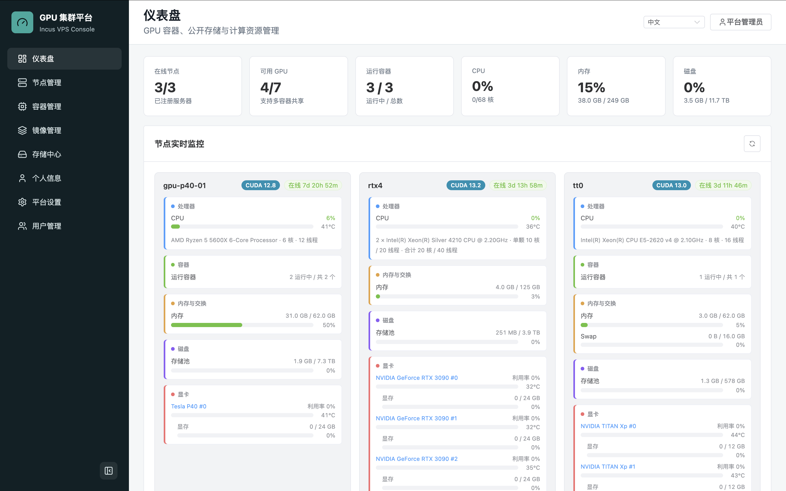

<h1 align="center">Server VPS</h1>

<p align="center">
  <a href="LICENSE"></a>
  <a href="README.en.md"></a>
</p>

面向小型课题组的 GPU 容器管理平台。server-vps 以一台管理节点和若干 GPU/存储节点为边界，帮助管理员把 Incus 容器、GPU 资源、用户额度、端口访问、数据目录和节点 agent 发布流程集中到一个 Web 控制台中。

默认部署只包含平台自身服务，认证方式为本地账号密码；外部 OIDC/CAS SSO、Casdoor 待审用户导入、平台自助注册等能力均为可选配置。

<p align="center">
  
</p>

## 项目定位

server-vps 适合这些场景：

- 小型课题组、实验室或课程环境，需要把少量 GPU 服务器开放给多名成员使用。
- 希望用户通过 Web 页面自助创建和管理 Linux 容器，而不是直接登录宿主机。
- 管理员需要维护用户配额、节点权限、容器端口、共享数据集、模型缓存和节点 agent 版本。
- 现有统一认证、监控、TLS 入口已有独立系统，希望平台只负责 GPU 容器资源管理。

它不是完整的 Kubernetes 替代品，也不内置身份服务、监控栈或公有云计费系统。

## 核心功能

- 仪表盘：汇总在线节点、GPU、运行容器、CPU、内存、磁盘，并展示节点实时监控。
- 节点管理：生成单节点 join token，维护节点类型、调度策略、资源上限、端口策略、WOL、同步地址和 SSH 公钥，支持节点 Shell、关机、重启、唤醒。
- Agent 发布：管理员可在 Web 控制台构建 `cluster-node-agent` / `cluster-agent-updater` 发布物，配置 stable/canary 自动更新，并触发节点升级。
- 容器管理：用户可选择镜像、节点、CPU/内存/GPU、SSH 用户和端口映射创建 Incus 容器；支持启动、停止、重启、Shell、资源调整、镜像发布和数据同步。
- 端口访问：平台分配管理节点公开端口，`port-router` 转发到计算节点 Incus proxy，用户无需直接访问计算节点。
- 存储中心：支持个人文件、共享数据集、模型资源、上传/下载/预览、Hugging Face / ModelScope 资源请求、ZFS 用户 dataset 和 workspace 卷管理。
- 用户与认证：默认本地账号密码；可选外部 OIDC/CAS SSO；管理员可维护用户、分组、额度、节点权限和 SSO 待审用户。
- 平台自助注册：可选开启，默认关闭；生产环境建议注册后由管理员审核启用。

## 架构边界

管理节点通过 Docker Compose 运行：

- `nginx`：唯一 Web/API 入口。
- `frontend`：Vue 3 + Vite + Element Plus 管理后台。
- `backend`：FastAPI API、调度、资源账本、agent 通信。
- `postgres`：平台数据库。
- `port-router`：在管理节点监听用户容器公开端口，并转发到计算节点。

GPU/存储节点原生运行：

- Incus。
- NVIDIA Driver 和 `nvidia-smi`，仅 GPU 节点需要。
- `cluster-node-agent`。
- 可选 `cluster-agent-updater`。

不属于当前 Compose 栈：

- Casdoor、Keycloak 或其他身份服务。它们可作为外部 OIDC/CAS Provider 接入。
- Prometheus/Grafana。节点 exporter 可由外部监控系统采集。
- TLS 终止。生产环境建议在平台前方放置外部反向代理或负载均衡。

## 快速启动

```bash
cp deploy/.env.example deploy/.env
```

至少修改：

```text
POSTGRES_PASSWORD
ADMIN_INITIAL_PASSWORD
PORT_ROUTER_TOKEN
```

默认情况下平台只显示本地账号登录；SSO 和注册策略可在管理员登录后的“平台设置”中启用。

启动：

```bash
./scripts/docker-build-run.sh
```

或手动运行：

```bash
docker compose -f deploy/docker-compose.yml up -d --build
```

访问：

```text
http://<管理节点IP>:<HTTP_PORT>/
```

初始管理员：

```text
用户名：admin
密码：deploy/.env 中的 ADMIN_INITIAL_PASSWORD
```

健康检查：

```bash
curl http://127.0.0.1:${HTTP_PORT:-80}/api/health
docker compose -f deploy/docker-compose.yml ps
```

## 关键配置

| 变量 | 说明 |
| --- | --- |
| `HTTP_PORT` | 管理节点 Web/API 入口端口 |
| `POSTGRES_PASSWORD` | PostgreSQL 密码，生产环境必须修改 |
| `ADMIN_INITIAL_PASSWORD` | 初始管理员密码，生产环境必须修改 |
| `PORT_RANGE_START` / `PORT_RANGE_END` | 用户访问容器服务时使用的管理节点公开端口池 |
| `NODE_PORT_RANGE_START` / `NODE_PORT_RANGE_END` | 计算节点 Incus proxy 内部端口池 |
| `PORT_ROUTER_TOKEN` | `port-router` 读取内部路由表的令牌，生产环境必须修改 |
| `SYNC_SSH_IDENTITY_FILE` | 跨节点数据同步使用的私钥路径 |
| `AGENT_SOURCE_HOST_PATH` | 后端通过 Docker 编译 agent 时使用的宿主机源码路径 |

完整部署说明见 [docs/deployment.md](docs/deployment.md)，环境变量模板见 [deploy/.env.example](deploy/.env.example)。

## 外部 SSO

server-vps 不内置或反代 Casdoor。平台默认使用本地账号；如需统一认证，可在管理员登录后进入“平台设置”启用外部 OIDC/CAS Provider。

接入独立 Casdoor 时，它只是一个外部 OIDC Provider。Casdoor SMTP、验证码、数据库迁移和密码迁移脚本应在 Casdoor 项目中维护。详见 [docs/authentication.md](docs/authentication.md)。

## 节点接入

1. 管理员登录平台，进入“节点管理”。
2. 生成单节点 join token。
3. 在新节点安装 Incus、NVIDIA 驱动和 `cluster-node-agent`。
4. 按页面生成的 `/etc/cluster-node-agent.env` 和 systemd service 启动 agent。仓库也提供 `deploy/systemd/` 示例文件，可按现场参数调整。
5. 节点上线后，在平台里创建测试容器。

完整流程见 [docs/node-onboarding.md](docs/node-onboarding.md)。

## 文档索引

- [docs/README.md](docs/README.md)：文档目录和推荐阅读顺序。
- [docs/deployment.md](docs/deployment.md)：管理节点部署、环境变量、升级和排障。
- [docs/authentication.md](docs/authentication.md)：本地账号、可选平台自助注册、外部 OIDC/CAS SSO。
- [docs/node-onboarding.md](docs/node-onboarding.md)：GPU/存储节点接入。
- [docs/storage-user-data-sync.md](docs/storage-user-data-sync.md)：用户目录、共享数据、模型资源和同步。
- [docs/architecture.md](docs/architecture.md)：当前架构和模块边界。

## 开发

后端：

```bash
cd backend
pip install -r requirements.txt
uvicorn app.main:app --reload --host 0.0.0.0 --port 8080
```

前端：

```bash
cd frontend
npm install
npm run dev
```

agent：

```bash
docker build --build-arg VERSION=dev -t cluster-node-agent-builder ./agent
docker create --name extract-agent cluster-node-agent-builder
docker cp extract-agent:/cluster-node-agent ./cluster-node-agent
docker cp extract-agent:/cluster-agent-updater ./cluster-agent-updater
docker rm extract-agent
```

## Star History

[](https://www.star-history.com/?repos=MTKSHU%2Fserver-vps&type=date&legend=top-left)
